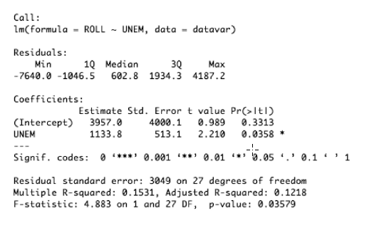
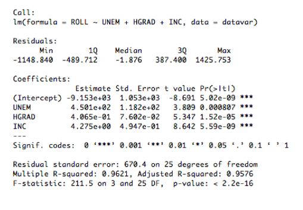
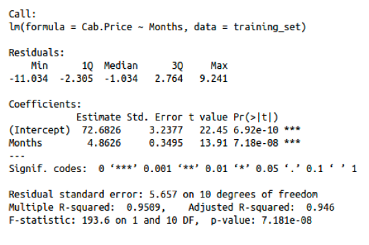

```{r setup, include=FALSE}
knitr::opts_chunk$set(echo = TRUE)
```

```{r message=FALSE, warning = FALSE}
library(ggplot2)
```


## Ejercicio 1
En un script de R realice una función que dado un dataframe cualquiera de dos columnas, donde la primera (índice 1) sea el valor de la variable independiente (X) y la segunda sea el valor de una variable dependiente (Y), devuelva una lista con los siguientes elementos:

1. Un arreglo con los valores de los estimadores para $\beta_0$ y $\beta_1$
2. El valor del coeficiente de determinación 𝑟# del modelo.
3. El coeficiente de correlación 𝑟.
4. Un arreglo con los valores de los residuos.
5. Una gráfica con la nube de puntos y la recta de regresión del modelo.

Nota: Para este ejercicio no está permitido utilizar la funciónlm() para calcular ninguno de los elementos solicitados (incisos 1 al 4), sin embargo puede utilizar ggplot para realizar la gráfica del inciso 5.


```{r}

# Preparacion de data dummy

x <- runif(n = 100, min = 1, max = 100)

noise <- rnorm(n = 100, mean = 0, sd = 10)

y <- x + noise

df <- data.frame(x,y)

```

```{r}

# Función

LinearModel <- function(df){
  x <- df[,1]
  y <- df[,2]

  # Cálculo del inverso de Monroe Penrose
  MPinverse = solve(t(x) %*% x) %*% t(x)
  
  # Cálculo de B0 y B1
  B1 <- MPinverse %*% y
  
  B0 <- mean(y) - (B1 * mean(x))
  
  # Vector de pesos
  weights <- c(B0, B1)
  
  predictions <- B0 + x*B1
  
  # Residuos
  residuals <- y - predictions
  
  # Cálculo de coeficiente de correlación
  R <- cov(x,y)/(sd(x)*sd(y))
  
  # Cálculo de coeficiente de determinacion
  R2 <- R^2 
  
  graph <- ggplot(df, aes(x, y)) + 
    geom_point() + 
    geom_abline(slope = B1, intercept = B0, col = "Blue") + 
    ggtitle("Modelo de regresión lineal")
  
  output <- list(weights,R2, R, residuals, graph)
  
  return(output)
}

```

```{r}
lm <- LinearModel(df)

paste("Coeficientes betas =", lm[[1]][1], lm[[1]][2], ", Coeficiente de determinación =", lm[[2]], ", Coeficiente de correlación =", lm[[3]])

hist(lm[[4]], main = "Residuos")

lm[[5]]

```


## Ejercicio 2

Para este ejercicio se le solicita que desarrolle las siguientes actividades utilizando RStudio con el dataset LAB #3 - Admissions que podrá encontrar en la sección de Material de Apoyo realice lo siguiente:

```{r message=FALSE, warning = FALSE}

library(dplyr)
library(GGally)
admissions <- read.csv("Admissions.csv")

```


1. Realice un análisis estadístico sobre todas las viarbales del dataset, recuerde que puede usar la función summary.

```{r}

# Summary function
glimpse(admissions)

summary(admissions)

```

2. Realice una gráfica de densidad para cada una de las variables numéricas en el dataset: GRE.Score, TOEFL.Score, CGPA, y Chance.of.Admit.

```{r}

# Gráficos de densidad

ggplot(admissions, aes(GRE.Score, ..density..)) +
geom_histogram(bins = 26, fill = "orange") + 
geom_density(col = "Red", size = 1) + 
theme_minimal() + 
ggtitle("Gráfico de densidad para GRE Score")
  

ggplot(admissions, aes(TOEFL.Score, ..density..)) +
geom_histogram(bins = 20, fill = "light blue") + 
geom_density(col = "Blue", size = 1) + 
theme_minimal() + 
ggtitle("Gráfico de densidad para TOEFL Score")
  
ggplot(admissions, aes(CGPA, ..density..)) +
geom_histogram(bins = 30, fill = "light green") + 
geom_density(col = "Dark Green", size = 1) + 
theme_minimal() + 
ggtitle("Gráfico de densidad para CGPA Score")


ggplot(admissions, aes(Chance.of.Admit, ..density..)) +
geom_histogram(bins = 25, fill = "light pink") + 
geom_density(col = "purple", size = 1) + 
theme_minimal() + 
ggtitle("Gráfico de densidad para Chance of admit")


```


3. Realice una gráfica de correlación entre las variables del inciso anterior:

```{r}

selection <- admissions %>% 
  select(GRE.Score, TOEFL.Score, CGPA, Chance.of.Admit)

ggpairs(selection, title = "Matriz de correlación para variables numéricas", progress = FALSE)

```

4. Realice comentarios sobre el análisis estadístico de las variables numéricas y el gráfico de correlación.

Como se puede observar en los análisis realizados para cada una de las variables numéricas, las 4 variables en cuestión siguen una distribución aproximadamente normal, con `Chance.of.Admit` siendo la que probablemente tiene más sesgo, en este caso a la izquierda. 

En este dataset se quiere determinar cuál es la probabilidad de que los alumnos sean admitidos dentro de una universidad, correlacionándolo con su score en dos tests, y con su GPA (*grade point average*). La variable Chance.of.Admit está definida dentro de un dominio de 0 a 1 por su naturaleza probablística. Cada una de las otras variables se encuentra en una escala propia.

El gráfico de correlación nos permite observar cuál de todas las variables muestra una mayor correlación con `Chance.of.Admit`. Como se observa en la matriz, la variable `CGPA` muestra la correlación de 0.882 con nuestra variable dependiente, seguido del `GRE.Score` con 0.81 de R, y por último el `TOEFL.Score` con 0.792.


5. Realice un scatter plot de todas las variables numéricas contra la variable Chance of Admit

```{r}

ggplot(admissions, aes(GRE.Score, Chance.of.Admit)) + 
  geom_point()+
  ggtitle("Gráfico de dispersión GRE Score vs. Chance of Admit") + 
  theme_minimal()

ggplot(admissions, aes(TOEFL.Score, Chance.of.Admit)) + 
  geom_point()+
  ggtitle("Gráfico de dispersión TOEFL Score vs. Chance of Admit") + 
  theme_minimal()

ggplot(admissions, aes(CGPA, Chance.of.Admit)) + 
  geom_point()+
  ggtitle("Gráfico de dispersión CGPA vs. Chance of Admit") + 
  theme_minimal()


```


6. Realice un modelo de regresión lineal simple con cada variable numérica como X y la variable Chance of Admit como Y.

```{r}
modelGRE <- lm(formula = Chance.of.Admit ~ GRE.Score, data = admissions)

modelTOEFL <- lm(formula = Chance.of.Admit ~ TOEFL.Score, data = admissions)

modelCGPA <- lm(formula = Chance.of.Admit ~ CGPA, data = admissions)

```

7. Realice una gráfica de cada modelo de regreisón lineal en su scatter plot correspondiente.


```{r}
ggplot(admissions, aes(GRE.Score, Chance.of.Admit)) + 
  geom_point()+
  ggtitle("Regresión lineal simple GRE Score vs. Chance of Admit") + 
  geom_smooth(method = "lm", se = FALSE, col = "Red") +
  theme_minimal()

ggplot(admissions, aes(TOEFL.Score, Chance.of.Admit)) + 
  geom_point()+
  ggtitle("Regresión lineal simple TOEFL Score vs. Chance of Admit") + 
  geom_smooth(method = "lm", se = FALSE, col = "Green") +
  theme_minimal()

ggplot(admissions, aes(CGPA, Chance.of.Admit)) + 
  geom_point()+
  ggtitle("Regresión lineal simple CGPA vs. Chance of Admit") + 
  geom_smooth(method = "lm", se = FALSE) +
  theme_minimal()

```

8. Como en la parte 2, realice un análisis sobre los resultados de cada modelo y diga cual de estos considera que es mejor y por qué

```{r}
summary(modelGRE)

```

```{r}
summary(modelTOEFL)

```


```{r}
summary(modelCGPA)
```

Se puede observar que de los tres modelos, se obtienen parámetros estadísticamente significativos, todos con un p valor muy pequeño. Además de eso, los modelos, como era de esperarse siguen un $R^2$ correspondiente al coeficiente de correlación entre las dos variables que se comparan. El modelo que mostró un $R^2$ mayor, y que por lo tanto es más explicativo de la variación observada, fue el de `CGPA` y `Chance.of.Admit`, con un R cuadrado de 0.7787. Este modelo, de la misma forma fue el que obtuvo una mayor estadística $F$, de 1752, y por lo tanto es un modelo estadísticamente significativo.


## Ejercicio 3 

A continuación se le muestran tres imágenes que muestran los resultados obtenidos de correr la función summary() a dos modelos de regresión lineal, para este ejercicio se le solicita que realice la interpretción de las tablas resultantes. Recuerde tomar en cuenta la significancia de los parametros (signifancia local), la significancia del modelo (significancia global), el valor del $R^2$ y cualquier observación que considere relevante para determinar si el modelo es estructuralmente adecuado o no.

### Modelo # 1:



En la primera imagen se observa un modelo de regresión lineal simple. Este modelo explica la variable ROLL por medio de `UNEM`. En este modelo se tiene un intercepto con un estimado no significativo (valor p de 0.3313), y un estimador para la pendiente significativo, pero con un p valor cercano a 0.05 (valor p de 0.0358). El $R^2$ de este modelo es de 0.1531, lo cual es relativamente bajo. Esto se debe a que no hay una correlación fuerte entre las dos variables del modelo. El estadístico $F$ tiene un resultado de 4.883, y si es significativo con un p valor de 0.03579. A pesar de tener una significancia global suficiente con un nivel de confianza del 95%, en este modelo la variable independiente tiene un bajo rendimiento al predecir la variable dependiente. 


### Modelo #2 



En este segundo modelo se utiliza un modelo de regresión lineal múltiple tomando en cuenta la variable utilizada en el primer modelo, y agregando dos variables explicatorias más, `HGRAD` e `INC`. Al agregar estas dos variables el rendimiento del modelo incrementa considerablemente. En cuanto a las signifancias locales para cada uno de los betas estimados, se observa en el summary que todas las variables tienen estimadores significativos, con una significancia muy cercana a 0. La estadística $F$ nos muestra que este modelo también es significativo, con un valor de 211 y un valor p muy cercano a 0. En este modelo, el $R^2$ ajustado es de 0.9576, lo cual es un valor muy alto para un modelo de regresión lineal. Por todas estas razones se considera que este es un adecuado modelo para explicar la variable `ROLL`. 

### Modelo #3



En el último modelo se utiliza un modelo de regresión lineal para predecir el precio de taxis dependiendo del mes del año. (`Cap.Price ~ Months`). Este modelo tiene alta significancia local, ya que cada uno de sus parámetros tienen un p valor muy cercano a 0. Este modelo tiene un $R^2$ muy alto a pesar de que es un modelo de regresion simple (0.9509). Al tomar en cuenta la significancia global, de igual forma se observa un modelo altamente significativo, con una estadística $F$ de 193.6, y un p valor muy cercano a 0.

